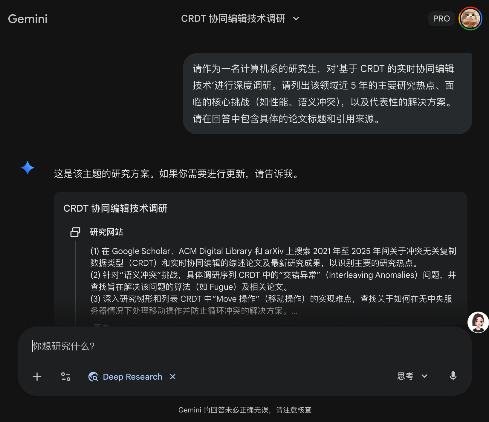

# 如何进行文献综述

在本科阶段参与科研项目或撰写毕业论文时，你面临的第一个挑战通常不是“怎么实现功能”，而是**“怎么写文献综述（Literature Review）”**。

很多同学对文献综述有误解，认为它只是把别人的话复述一遍。其实不然，文献综述的本质是**“讲故事”**——你需要告诉读者：在这个领域，前人已经做了什么？还有什么没做？以及，为什么我要做现在这个研究？

本文将介绍一套结合了传统工具与现代 AI 技术的科研工作流，助你高效完成文献综述。

## 第一步：像侦探一样寻找线索 —— 谷歌学术 (Google Scholar)

不要用百度搜论文！不要用百度搜论文！不要用百度搜论文！（重要的事情说三遍）。
进行计算机科学（CS）领域的调研，Google Scholar 是你的首选战场。

1. 基础搜索技巧

关键词组合：不要只搜一个词。例如做“实时协同”，试试 Real-time collaborative editing CRDT 或 OT algorithm collaborative programming。

年份过滤：CS 领域发展极快。除非是寻找鼻祖级的算法（比如 1989 年的第一篇 OT 论文），否则建议优先关注近 3-5 年的论文，以确保你的研究没有过时。

2. 顺藤摸瓜：利用引用关系

这是 Google Scholar 最强大的功能。

被引用次数 (Cited by)：如果一篇文章被引用了上千次，它大概率是该领域的经典（必读）。点击“Cited by”，你可以看到后来的人是如何评价和改进这项工作的。这能帮你找到更新的论文。

相关文章 (Related articles)：当你找到一篇非常契合你方向的论文时，点击这个链接，Google 会通过算法推荐相似的文章。

3. 善用高级搜索

点击左上角菜单中的“高级搜索”，你可以限定搜索范围。例如，只搜索标题中包含 Real-time 的文章，这样出来的结果会精准得多。

第二步：给你的文献安个家 —— EndNote 文献管理

下载了一堆 PDF 丢在桌面上？文件名全是 1234.pdf？等到写论文要插入参考文献时，你会崩溃的。
你需要一个文献管理软件。虽然 Zotero 也很流行且免费，但EndNote 是学术界的老牌劲旅，且很多高校（通常在学校图书馆官网）都购买了正版授权供学生免费下载。

## EndNote 能帮你做什么？

请看本文档对于[EndNote](random_notes/using_endnote.md)的描述。

## 第二步：AI 时代的“深阅读” —— 利用大模型做 Deep Research

面对浩如烟海的文献，每篇都从头读到尾是不现实的。现在的 AI 大模型已经进化出了强大的深度研究 (Deep Research) 能力，它们不仅能帮你读，还能帮你“搜”和“写”。

**1. 自动化调研：利用大模型的“深度研究”模式（重中之重）**

现在很多主流大模型都推出了联网深度搜索功能。这与普通的问答不同，AI 会自主进行多轮搜索、阅读网页内容、交叉验证信息，最后生成一份带引用的报告。这非常适合用于项目开始时的泛读和背景调查。

**Google Gemini (Deep Research / 深度研究)**：依托 Google 强大的搜索引擎，Gemini 在处理最新信息和长篇复杂的调研任务上表现优异。你可以要求它生成一份“2025年实时协同算法综述”，它会搜索大量网页并总结。

**豆包 (Doubao - 深度搜索)**：字节跳动的豆包提供了“深度搜索”模式，非常适合中文语境下的调研，且对国内的资料覆盖较好，回答通常结构清晰，适合快速入门。

**OpenAI ChatGPT (Search / Deep Research)**：现在的 ChatGPT (特别是 Pro 版本) 具备了强大的自主搜索能力，能够进行迭代式搜索，直到找到令你满意的答案。

**Perplexity AI**：这是一个专门为“搜索答案”设计的 AI 引擎，它的每一次回答都会列出详细的引用来源（Citations），非常适合科研溯源。

Prompt 示例：
“请作为一名计算机系的研究生，对‘基于 CRDT 的实时协同编辑技术’进行深度调研。请列出该领域近 5 年的主要研究热点、面临的核心挑战（如性能、语义冲突），以及代表性的解决方案。请在回答中包含具体的论文标题和引用来源。”

**2. 快速筛选 (Screening)**

不要直接读正文。把论文的 Abstract (摘要) 和 Conclusion (结论) 复制给 AI。

Prompt 示例：
“我正在研究实时协同编程中的冲突解决算法。请阅读以下摘要，告诉我这就这篇论文的核心贡献是什么？它使用了什么方法？它是否与 CRDT 相关？如果相关，它的创新点在哪里？”

如果 AI 的回答让你觉得这篇论文很有价值，你再下载全文去精读。

**3. 辅助精读 (Deep Reading)**

对于核心论文，遇到看不懂的长难句、复杂的数学公式或伪代码，直接截图或复制给 AI。

Prompt 示例：
“请像给本科生讲课一样，解释一下这个公式中每个符号的含义。”
“这段伪代码实现了什么逻辑？请用 Python 风格的伪代码重写一遍以便我理解。”

**4. 跨文档综合分析 (Synthesis) —— 高阶玩法**

现在的长上下文（Long Context）模型（如 Gemini 1.5 Pro, Claude 3）允许你一次性上传多篇 PDF。
你可以把 5 篇相关的论文全部丢给它，然后问：

Prompt 示例：
“这 5 篇论文都讨论了协同编辑中的延迟问题。请对比一下它们提出的解决方案有何异同？并以表格形式总结它们的优缺点。”

⚠️ 警告：

AI 会产生幻觉：永远不要让 AI 帮你“写”文献综述，也不要盲目相信它引用的数据。AI 是你的阅读助手，不是你的代笔。 所有的结论，必须是你自己回到原文确认过的。

数据隐私：不要上传未发表的、保密的科研数据给公开的大模型。

### 最主要的：进行Deep Research

## 第三步：开始写作 —— 漏斗式结构

当你读完了文献，准备动笔时，请遵循**“漏斗式”**结构：

宽泛的背景 (Broad Context)：“实时协同编程在远程工作中变得越来越重要...”

细分领域现状 (Specific Area)：“为了解决并发冲突，目前的解决方案主要分为 OT 和 CRDT 两大类。其中 OT 算法...”

指出现有研究的不足 (The Gap)：这是最关键的一步。“然而，现有的 CRDT 算法在处理代码语义冲突时表现不佳...”

引出你的研究 (Your Work)：“因此，本文提出了一种基于 AST 的新型协同机制...”

## 写在最后

文献综述不是一蹴而就的。它需要你不断地检索、阅读、思考、再检索。利用好 Google Scholar 找矿，利用 EndNote 管矿，利用 AI 帮你炼矿，你会发现科研其实也是一件非常有意思的事情。