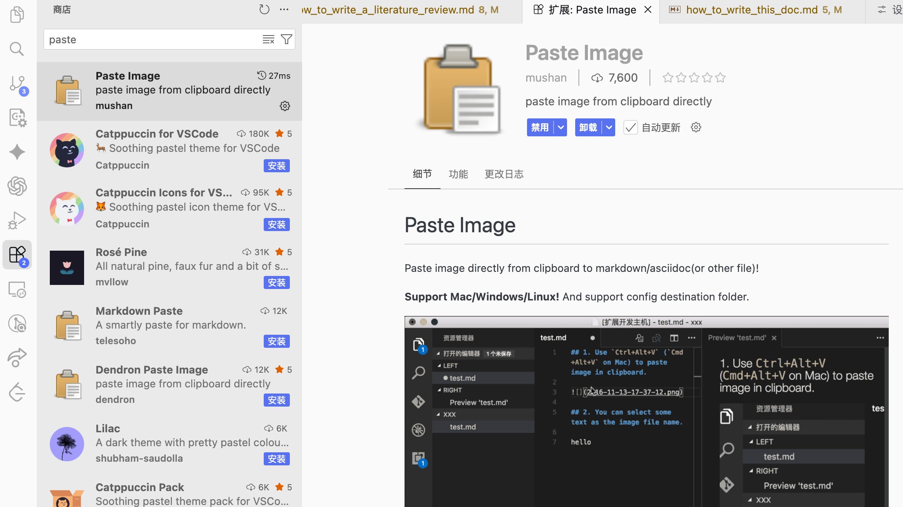
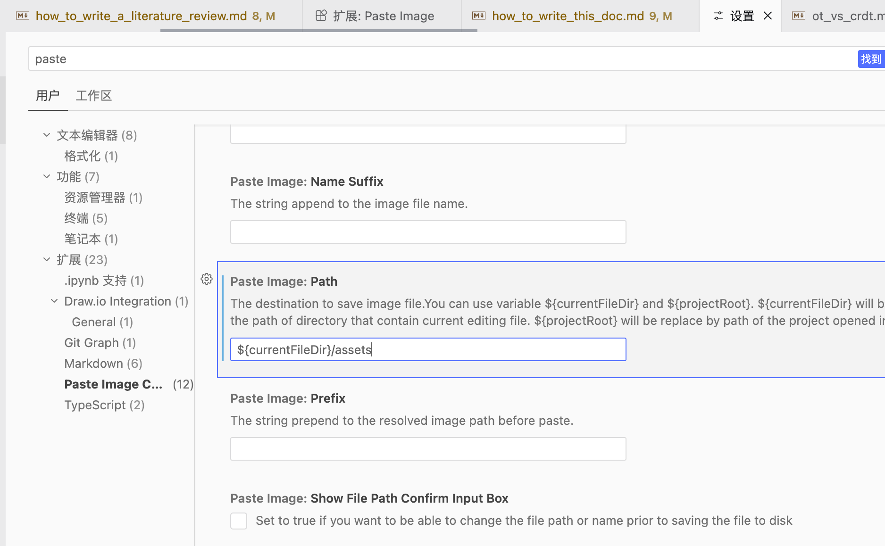

# 如何优雅地编辑本文档

## 项目文件架构速览
为了方便协同编写，这个仓库按照用途拆分为多个顶层目录：

- `collaboration_tools/`：与实时协同工具相关的系统设计、协议、模块解析等长篇文档。
- `random_notes/`：琐碎的学习笔记或写作说明，本文档也放在这里，配套图片统一存在 `random_notes/assets/`。
- `ai_coding/`、`git/`、`vscode_plugin/` 等：围绕不同主题整理的专题资料，通常含有独立的 `assets/` 子目录来存放插图。
- 根目录下的 `README.md`、`_sidebar.md`、`index.html` 负责站点导航与入口信息，其他如 `tech_stack/`、`rcp/`、`courses/` 等目录则各自承载对应内容。

在撰写文档时，按照内容所属领域选择对应目录，新建或补充 `.md` 文件即可；插图请放到同级的 `assets/` 文件夹中，保持命名和引用路径统一。

## VS Code 快速粘贴图片的推荐流程
1. 在 VS Code 中安装 **Paste Image** 插件。

2. 打开“设置”，搜索 *Paste Image*，将 `Paste Image: Path` 改为 `${currentFileDir}/assets`，这样图片会自动保存到当前 Markdown 文件所在目录的 `assets` 子目录。

3. 在 Markdown 中定位光标，使用快捷键粘贴图片：Windows/Linux 为 `Ctrl + Alt + V`，macOS 为 `Command + Option + V`。
4. 插件会自动在 `assets/` 中创建图片文件，并在文档里插入正确的 Markdown 引用（例如 ``），无需手动调整路径。

借助上述设置，就能保持仓库结构整洁，同时高效地把截图嵌入到本文档或其他 Markdown 文件中。***
