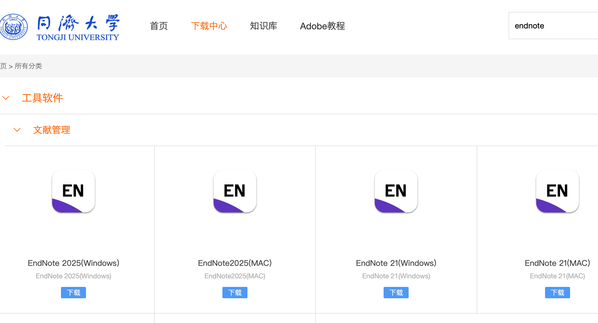
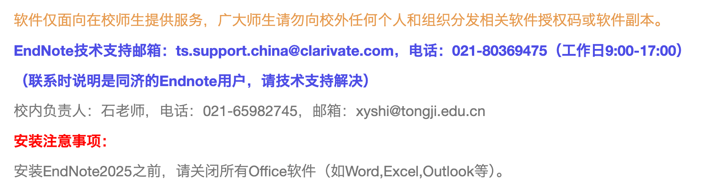
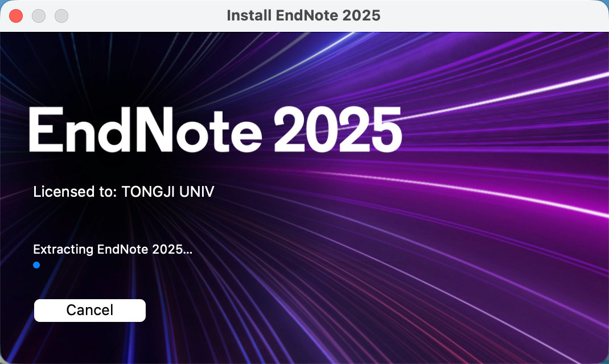
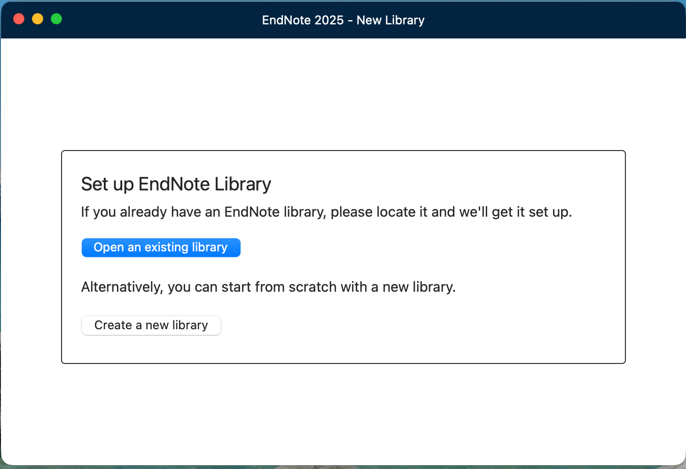
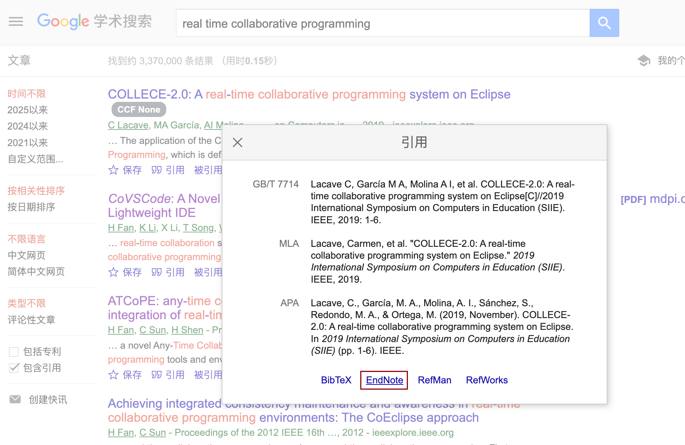
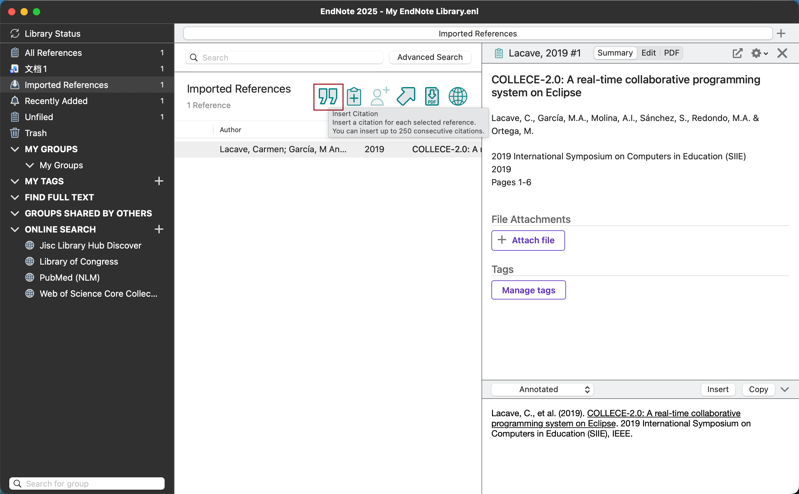
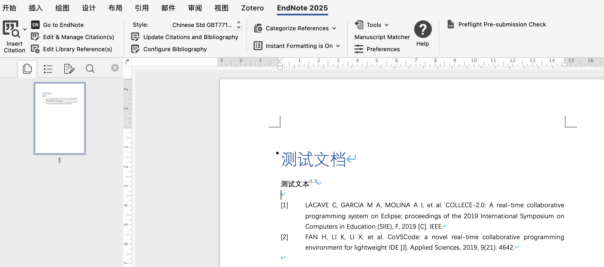
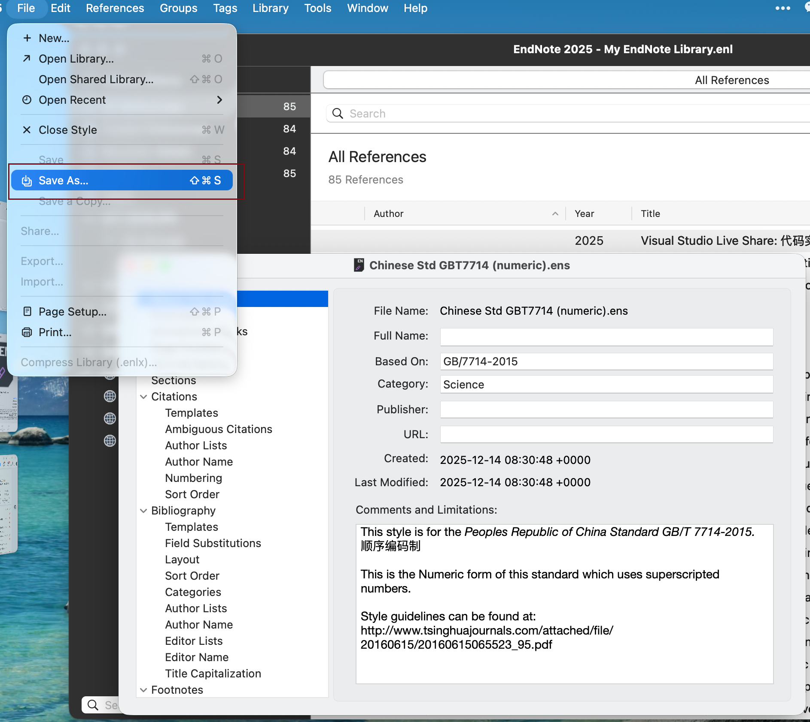

# 如何使用 EndNote 进行文献管理

EndNote 适合个人或团队在 Windows/macOS 上集中管理论文条目、全文 PDF、批注以及 Word 写作过程中的引用需求。下面整理一套从安装到引用的常用操作流程，可以按需取用。

## 下载与安装

1. **下载安装包**：建议直接从同济正版化平台获取最新版（https://software.tongji.edu.cn/index.html），也可以从 EndNote 官网试用。
2. **安装语言包与 Word 插件**：安装向导中勾选 Cite While You Write（CWYW）组件，它会自动在 Word 中安装 EndNote 选项卡。
3. **激活/登录**：首次启动可选择离线使用，也可以注册 EndNote Online 账号以同步文献库。

## 初始化与文献导入

### 创建文献库
- `File -> New` 建立 `.enl` 文件，并把默认的 `*.Data` 文件夹和库文件放在同一目录，避免云盘同步只传一个文件。
- 可建立多个库，例如“课程论文”“毕业设计”等。

### 导入文献
1. **数据库直接导出**：在 Web of Science、ProQuest、CNKI 等数据库中选择 `Export -> EndNote`，下载 `.ris/.enw` 文件后双击即可导入。
2. **PDF 批量导入**：`File -> Import -> Folder`，Import Option 选择 `PDF File or Folder`，EndNote 会尝试解析 DOI/元数据并生成条目。
3. **在线检索**：`Tools -> Online Search` 连接 PubMed、Library Catalog 等，检索结果直接保存到本地库。
4. **Google Scholar 导入**：在谷歌学术中搜索时可以下载endnote格式，打开即可导入

### 清理与整理
- **去重**：`References -> Find Duplicates`，逐条确认保留的记录。
- **分组**：在左侧 `Groups` 面板创建自定义组；若设置 Smart Group（保存检索条件），可自动把新条目放入对应分组。
- **附件与批注**：右侧 Panel -> `PDF` 选项卡可以高亮、评论，也可以绑定本地 PDF（`Attach File`）。

## 同步与备份

- `Edit -> Preferences -> Sync` 中登录 EndNote Online，同步可让多台设备共享文献库。
- `File -> Compressed Library (.enlx)` 可以将库和数据打包备份，适合跨设备迁移或分享给同事。

## 在 Word 中引用

EndNote 会在 Word 添加 “EndNote” 选项卡，常用按钮如下：

1. **插入引用**：光标放在需要引用的位置，点击 `Insert Citation -> Find Citation`，输入作者/标题关键词选择条目，EndNote 会按照当前样式插入 `[1]` 或 (Author, Year)。
2. **编辑引用**：使用 `Edit & Manage Citation(s)` 修改页码（Pages 字段）、隐藏作者/年份、合并多条引用。
3. **切换样式**：在 Word 的 EndNote 选项卡或 EndNote 主程序右下角 `Style` 下拉框选择目标样式（如 APA、Chicago、GBT7714）。
4. **更新/临时禁用交叉引用**：`Update Citations and Bibliography` 刷新参考文献列表；`Instant Formatting -> Turn Off` 可暂停自动刷新以提升性能。

## Chinese Standard GBT7714 (numeric)

- [样式下载地址](https://endnote.com/downloads/styles/chinese-standard-gb-t7714-numeric/?srsltid=AfmBOoomK5h4t2RmgoF0lbXKnK4UxNUxDPXcjpYz97fJuLh2gVhUQyy_)（`.ens` 文件）。
- 双击打开`.ens`文件，点击File->`Save As`保存为样式
- 如果学校定制版有特殊要求（如作者姓名格式、页码位置），可在 `Edit -> Output Styles -> Edit "Chinese Standard GBT7714..."` 中进一步调整。

## Web Page 引用字段

默认 Web Page 模板常与国内格式不完全一致，建议在 Output Style 中修改该 Reference Type 的 Template，使其符合：`Title [EB/OL]. [Access Date]. URL.`  
之后在条目中填写 `Title`、`URL`、`Access Date`（形如 `2023-08-01`），即可自动生成符合国标的网页引用。

## 常见问题与技巧

- **无法正常显示中文作者**：检查条目 `Author` 字段格式为 “姓, 名”，并确认样式允许中文全名。
- **样式未生效**：Word 端样式与 EndNote 主程序应保持一致，必要时在 Word 中重新浏览加载 `.ens` 文件。
- **团队协作**：可以在同一库中创建 Group，右键 `Share Group...` 与同伴共享，同时设定只读/可编辑权限。
- **快捷检索**：在 EndNote 主界面使用 `⌘ + F` / `Ctrl + F` 搜索所有字段，或前往 `Tools -> Find Full Text` 批量尝试下载可用 PDF。

## 参考链接

- https://zhuanlan.zhihu.com/p/269732849
- https://www.bilibili.com/video/BV1JF411a7sn
