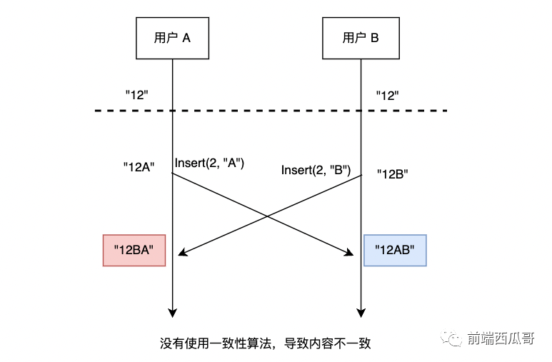

# OT算法 vs CRDT算法

在深入探讨这两种算法之前，我们首先要回答一个根本性问题：**为什么我们需要 OT 或者 CRDT？** 如果没有它们，协同编辑会发生什么？

## 一切混乱的根源：并发冲突

想象一个最简单的场景：你（Alice）和你的伙伴（Bob）同时打开了一份内容为 `cat` 的文档。

1. **初始状态**：`cat`
2. **你的操作**：你想把它改成 `cats`，于是在第 3 位插入了 `s`。操作指令为 `insert(3, 's')`。
3. **伙伴的操作**：与此同时，你的伙伴想把它改成 `car`，于是他删除了第 2 位的 `a`，并插入了 `r`。操作指令为 `delete(1, 1)` 和 `insert(1, 'r')`。

现在，如果没有一个“裁判”来协调，混乱就出现了：

- 在你的电脑上，先执行你的 `insert(3, 's')` 得到 `cats`，再执行伙伴发来的指令 `delete(1, 1)` 和 `insert(1, 'r')`，结果是 `crts`。
- 在你伙伴的电脑上，先执行他的操作得到 `cr`，再执行你发来的指令 `insert(3, 's')`，结果是 `crs`。

**最终你们得到了两个完全不同的结果：`crts` vs `crs`。** 文档出现了**不一致**，协同失败。

这个问题的本质是，当多个用户并发地修改同一份数据时，简单的指令无法在不同的副本上产生相同的结果。**OT 和 CRDT 的核心使命，就是提供一套可靠的数学模型，确保无论操作以何种顺序、在何时被应用，所有副本最终都能达到完全一致的状态（即“最终一致性”）。**

## 什么是OT算法？

## OT (Operational Transformation) 算法

OT 是协同技术领域的“老前辈”，大名鼎鼎的 Google Docs 和微软的 Office Online 都曾基于它构建。

### 核心思想：聪明的“中央秘书”

我们可以把 OT 的工作模式想象成一个团队和一个高度负责的**中央秘书**（服务器）协同工作。

1. **提交修改**：你和你的伙伴不对报告原文直接动手。而是把自己想做的修改（“在第 5 个字后面插入‘重要’”、“删除第 10 到 15 个字”）写成指令，发给中央秘书。
2. **秘书处理**：秘书维护着报告的唯一最终版本。当他收到一个指令时，他会先看一下。如果在你提交指令的同时，你的伙伴也提交了指令，并且那个指令已经被秘书处理掉了（比如他在你前面删了几个字），那么你的指令“在第 5 个字后面插入”可能就不准确了。
3. **转换操作**：这时，聪明的秘书会“转换”（Transform）你的操作指令。他会计算，考虑到你伙伴刚才的修改，你原本的意图应该对应到当前报告的哪个位置。比如，他可能会把你的指令“转换”成“在第 2 个字后面插入‘重要’”。
4. **广播结果**：秘书在主报告上应用了转换后的指令，然后把这个最终生效的修改结果通知给团队里的每一个人，让大家更新自己的视图。

### 专业解读

- **操作（Operation）**：OT 的核心是“操作”，即用户的每一个意图，如 `insert(position, text)` 或 `delete(position, length)`。
- **转换（Transformation）**：OT 算法最关键的部分是一系列转换函数，例如 `transform(op1, op2)`。这个函数的作用是，在已知 `op2` 已经发生的情况下，如何修改 `op1` 使其能够正确应用在新的文档状态上。
- **中心化架构**：传统的 OT 算法高度依赖一个中央服务器来确定操作的最终顺序和执行转换。这保证了强一致性，但也使得系统的架构变得复杂，并且对服务器的稳定性和可用性要求很高。
- **复杂度**：OT 的理论很优美，但实现起来极其复杂。设计一个能处理所有并发情况的转换函数非常困难，这也是它最大的技术壁垒。

## 什么是CRDT算法？

CRDT 是近年来在分布式系统和协同应用领域声名鹊起的“后起之秀”。大家熟知的 Figma、Apple Notes 以及我们项目中可能用到的 Y.js 都是它的忠实拥趸。

### 核心思想：自带规则的“魔法笔记”

CRDT 的模式则完全不同，它不需要中央秘书，而是给每个团队成员发了一本**魔法笔记**。

1. **本地修改**：你可以在自己的魔法笔记上随意修改，你的伙伴也可以。所有的修改都是立即在本地生效的。
2. **自由交换信息**：你们可以通过任何方式（邮件、吼叫、飞鸽传书）把自己的修改内容告诉对方。信息可以延迟到达，甚至可以顺序错乱。
3. **自动合并**：魔法笔记的神奇之处在于，它内部有一套固定的数学规则。无论何时收到来自他人的修改，它都能自动、正确地将这些修改合并到自己的内容里，并且能保证，只要所有人都收到了全部的修改信息，那么**最终所有人笔记里的内容都会变得一模一样**。它从设计上就“无视”了冲突。

## 专业解读

- **数据结构（Data Type）**：CRDT 的核心是“数据结构”。它设计的不是一个处理操作的算法，而是一种天生就能处理并发、不会产生冲突的数据结构。
- **无冲突（Conflict-free）**：这是通过严格的数学定律来保证的。CRDT 的操作需要满足某些特性（如交换律、结合律），这保证了操作无论以何种顺序应用，最终结果都是一致的。
- **去中心化架构**：CRDT 不需要中央服务器来协调。每个副本（客户端）都是平等的，可以独立工作（支持离线编辑），然后在有网络连接时再与其他副本同步。这使得它非常适合 P2P（点对点）网络和对离线支持有高要求的应用。
- **实现方式**：主要有两种类型的 CRDT：
  - **基于状态的 CRDT (CvRDT)**：每次同步时，发送整个对象的完整状态。合并逻辑简单，但数据量可能较大。
  - **基于操作的 CRDT (CmRDT)**：每次同步时，只发送引起变化的操作。数据量小，但对通信层的要求更高（需要保证操作不丢失）。

## 总结：OT vs. CRDT，如何选择？

| 特性 | OT (操作转换) | CRDT (无冲突复制数据类型) |
| :--- | :--- | :--- |
| **核心思想** | 转换（Transform）有冲突的操作指令 | 设计（Design）无冲突的数据结构 |
| **工作模式** | 像一个有**中央秘书**的团队 | 像一本本自带规则的**魔法笔记** |
| **系统架构** | 强依赖**中心化服务器** | 天然支持**去中心化**和 P2P |
| **离线支持** | 较弱，依赖与服务器的连接 | 非常好，支持离线编辑和后续同步 |
| **实现复杂度** | 转换函数的逻辑**极其复杂**，容易出错 | 数据结构本身的设计有挑战，但应用层逻辑相对简单 |
| **适用场景** | 传统的在线文档、代码编辑器 | 新一代协同应用、P2P 聊天、需要离线支持的场景 |
| **知名应用** | Google Docs (早期), Etherpad | Apple Notes, Figma, Y.js, Atom Teletype |

总而言之，没有绝对的优劣，只有场景的适配。

- **OT** 像一个精密的外科手术，强大但对环境（中央服务器）和医生（算法实现）的要求极高。它在处理纯文本协同上，有着非常成熟的理论和实践积累。
- **CRDT** 则像一个具有强大自愈能力的生物体，极具韧性，不惧怕恶劣的网络环境，是构建现代分布式、高可用协同应用的大势所趋。

对于我们的项目来说，理解这两种技术的思想，能帮助我们更好地读懂 `eclipse-oct/open-collaboration-tools` 项目在协同技术选型上的考量。