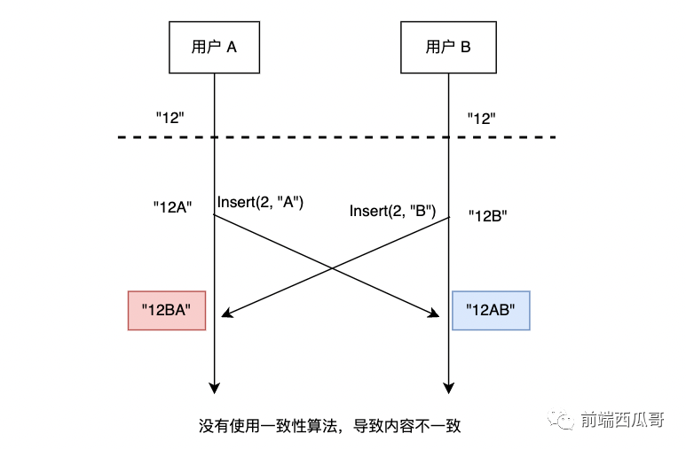

# OT 算法 vs CRDT 算法

在讨论这两种算法之前，先回答一个更基本的问题：**为什么需要它们？** 如果没有 OT 或 CRDT，协同编辑会怎样？

## 问题：并发冲突

假设你和同伴（Bob）同时打开一份内容为 `cat` 的文档：

1. **初始状态**：`cat`
2. **你的操作**：想改成 `cats`，在第 3 位插入 `s`，即 `insert(3, 's')`。
3. **同伴的操作**：想改成 `car`，删除第 2 位的 `a` 并插入 `r`，即 `delete(1, 1)` 和 `insert(1, 'r')`。

如果没有一个机制来协调，两边会得到不同结果：

- 在你的电脑上：先执行 `insert(3, 's')` 得到 `cats`，再执行同伴的 `delete(1, 1)` 和 `insert(1, 'r')`，结果是 `crts`。
- 在同伴的电脑上：先执行自己的操作得到 `cr`，再执行你的 `insert(3, 's')`，结果是 `crs`。

**两边得到了不同的结果，文档不再一致。**

问题的本质是：多个用户并发修改同一份数据时，简单的操作指令在不同副本上会产生不同结果。OT 和 CRDT 的目标，就是提供一套机制，保证无论操作以什么顺序、在什么时间应用，所有副本最终都达到完全一致的状态（最终一致性）。

## OT (Operational Transformation)

OT 是协同技术里较早的方案，Google Docs 和微软 Office Online 早期都基于它构建。

### 基本思路：由中心服务器协调

OT 依赖一个中心服务器来维护文档的唯一版本，并确定操作的顺序：

1. **提交操作**：客户端把修改写成指令（如 `insert(5, '重要')`、`delete(10, 5)`）发给服务器，而不是直接改本地最终结果。
2. **服务器处理**：服务器维护唯一版本。如果在你提交的同时，同伴的操作已经被服务器处理（比如他先删了几个字），你指令里的位置可能已经不准了。
3. **转换操作**：服务器会对你的操作进行“转换”（Transform），根据已经应用的其他操作，把你原本的位置映射到当前文档的正确位置。例如把“第 5 个字后插入”转换成“第 2 个字后插入”。
4. **广播结果**：服务器把转换后的操作应用到主版本，再把结果广播给所有客户端更新视图。

### 要点

- **操作 (Operation)**：OT 的核心是操作，例如 `insert(position, text)`、`delete(position, length)`。
- **转换 (Transformation)**：算法最关键的部分是转换函数，如 `transform(op1, op2)`：已知 `op2` 已发生，如何调整 `op1` 使其能正确应用在新状态上。
- **中心化架构**：传统 OT 依赖中央服务器确定操作顺序并执行转换，保证强一致性，但对服务器的稳定性和可用性要求较高。
- **实现复杂**：设计一个能覆盖所有并发情况的转换函数非常困难，这是它最大的技术门槛。

## CRDT (Conflict-free Replicated Data Type)

CRDT 是近年来在分布式系统和协同应用中广泛使用的方案，Figma、Apple Notes 以及我们项目里用到的 Y.js 都属于这一类。

### 基本思路：每个副本各自合并

CRDT 不依赖中心服务器，而是让每个客户端各持一份副本：

1. **本地修改**：每个人直接修改自己的副本，修改立即在本地生效。
2. **交换信息**：修改通过任意方式传给其他人，允许延迟到达，甚至顺序错乱。
3. **自动合并**：副本内部有一套固定的数学规则，收到他人的修改后能自动、正确地合并。只要所有人都收到了全部修改，最终每个人副本里的内容都会一致。合并逻辑本身从设计上就不会产生冲突。

## 要点

- **数据结构 (Data Type)**：CRDT 的核心是数据结构。它设计的不是处理操作的算法，而是一种天生能处理并发、不产生冲突的数据结构。
- **无冲突 (Conflict-free)**：靠严格的数学性质保证。CRDT 的操作满足交换律、结合律等特性，因此无论以何种顺序应用，最终结果都一致。
- **去中心化架构**：不需要中央服务器，每个副本地位平等，可以独立工作（支持离线编辑），有网络时再同步。适合 P2P 和离线场景。
- **实现方式**：主要有两类：
  - **基于状态的 CRDT (CvRDT)**：同步时发送整个对象的完整状态，合并逻辑简单，但数据量可能较大。
  - **基于操作的 CRDT (CmRDT)**：只发送引起变化的操作，数据量小，但要求通信层不丢操作。

## 总结：如何选择

| 特性 | OT (操作转换) | CRDT (无冲突复制数据类型) |
| :--- | :--- | :--- |
| **核心思想** | 转换有冲突的操作指令 | 设计不会冲突的数据结构 |
| **协调方式** | 由中心服务器确定顺序并转换 | 各副本独立合并 |
| **系统架构** | 依赖中心化服务器 | 支持去中心和 P2P |
| **离线支持** | 较弱，依赖与服务器的连接 | 较好，支持离线编辑和后续同步 |
| **实现复杂度** | 转换函数逻辑复杂，容易出错 | 数据结构设计有难度，应用层相对简单 |
| **适用场景** | 传统在线文档、代码编辑器 | 新一代协同应用、P2P 聊天、需要离线支持的场景 |
| **典型应用** | Google Docs (早期), Etherpad | Apple Notes, Figma, Y.js, Atom Teletype |

两者没有绝对优劣，主要看场景：

- **OT** 依赖中心服务器和成熟的转换函数实现，在纯文本协同上有长期积累。
- **CRDT** 更适应网络不稳定、需要离线支持的场景，是构建分布式协同应用的常见选择。

对我们项目来说，理解这两种思想，有助于读懂 `eclipse-oct/open-collaboration-tools` 在协同技术选型上的取舍。
