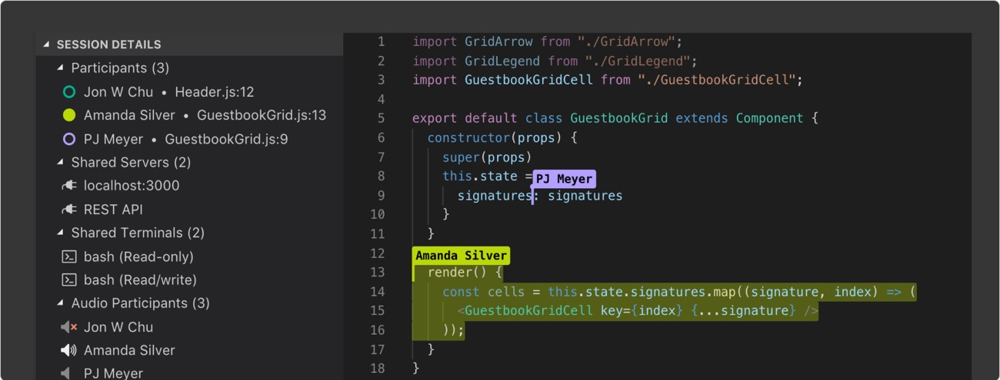
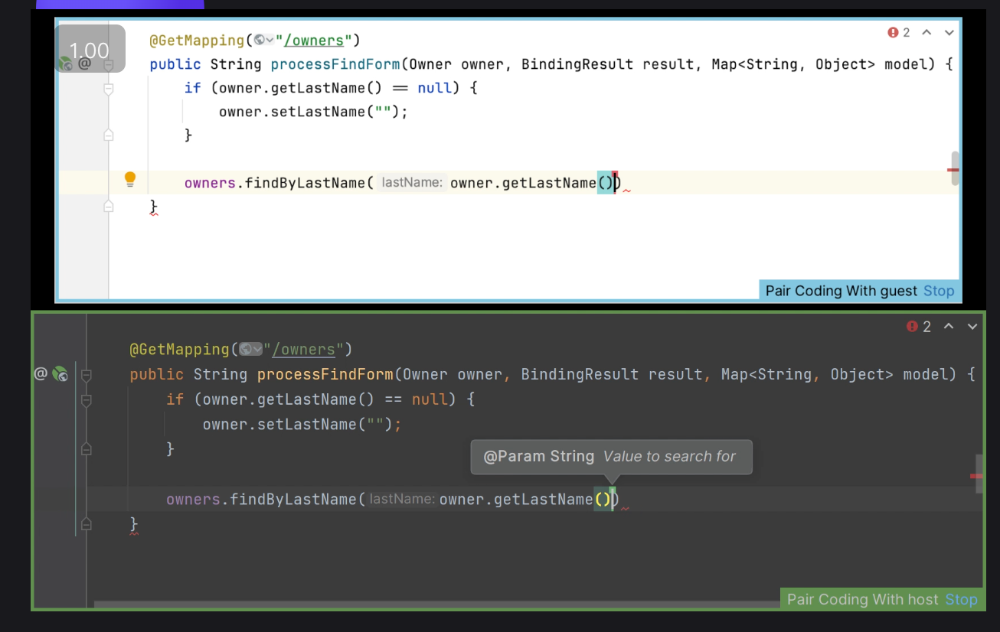
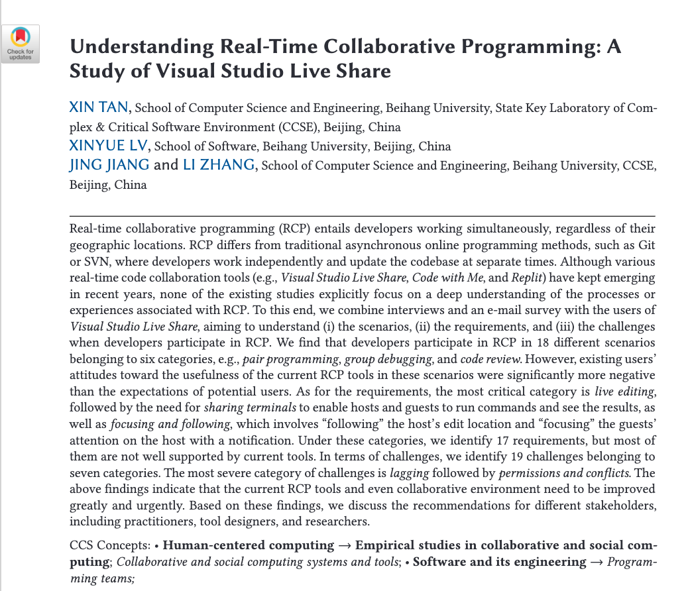
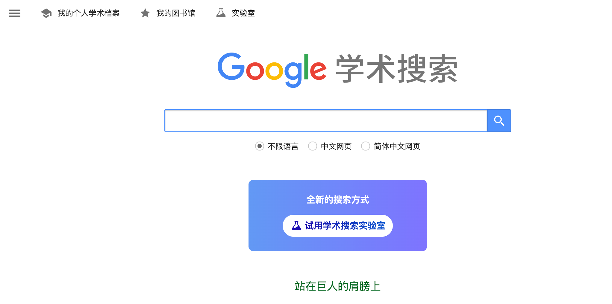

# 什么是实时协同编程？

实时协同编程（Real-Time Collaborative Programming, RCP）是一种允许多个用户像共同编辑在线文档一样，在各自的电脑上实时、同步地编辑同一份代码的编程范式。

这个概念可能乍一听有些抽象，我们可以用一个更常见的场景来类比：**腾讯文档**或 **Google Docs**。

> 想象一下，为了规划一场“说走就走”的旅行，你和几个“旅游搭子”新建了一个在线文档。A 和 B 负责研究和填写机票信息，C 和 D 同步规划行程路线，而 E 则在文档的另一处搜集和整理门票资料。所有人都能立刻看到彼此的更新。

实时协同编程就是这种模式在软件开发领域的应用，只不过文档变成了复杂的代码项目，“旅游搭子”变成了并肩作战的程序员。由于代码的结构化和逻辑性要求极高，其技术挑战也远超普通文档。

可以参考 [VS Code Live Share 的官方演示](https://visualstudio.microsoft.com/zh-hans/services/live-share/)，直观地感受一下它的魅力。

当然，我个人觉得JetBrains的Code With Me做得更好

## 为什么它很重要？

实时协同编程不仅仅是一个“酷炫”的功能，它在多个场景下都具有巨大的实用价值：

- 高效的结对编程 (Pair Programming)：两名开发者可以共享一个开发环境，一人编码，一人审查，实时交流想法，极大提升代码质量和问题解决速度。
- 无缝的远程协作 (Remote Work)：团队成员无论身处何地，都能像坐在同一间办公室一样共同处理复杂的 Bug 或开发新功能。
- 实时的教学与辅导 (Mentoring)：老师或资深工程师可以进入学生的编辑器，手把手地指导代码、讲解逻辑，提供最直观的帮助。
- 在线面试 (Online Interview)：面试官可以直接在共享环境中观察候选人的编码过程和解题思路。

## 核心特征

- 实时性 (Real-Time)：任何一位用户对代码的增、删、改操作，都能在毫秒级延迟内同步到所有其他协作者的屏幕上，做到“所见即所得”。
- 并发性 (Concurrency)：系统支持多个用户同时在文件的不同位置、甚至是相同位置进行编辑，而不会因为锁定机制导致“一人编辑，他人等待”的尴尬。
- 冲突解决 (Conflict Resolution)：这是 RCP 的技术核心。当多个用户同时修改同一行代码时，系统必须拥有一套智能的算法来自动合并修改，解决冲突，保证代码的最终一致性。这通常依赖于 **OT (Operational Transformation)** 或 **CRDT (Conflict-free Replicated Data Type)** 等算法，我们会在后续章节深入探讨。

## 主要挑战

尽管前景美好，但实现一个稳定、易用的 RCP 系统也面临诸多挑战，这点我们也会在后续章节深入探讨：

- 技术挑战：如何降低延迟、如何设计高效的冲突解决算法、如何保证跨网络传输的安全性、如何管理复杂的状态同步等。
- 协同挑战：如何让协作者感知到他人的位置（光标）和意图、如何避免相互干扰、如何在高强度的协作中保持顺畅的沟通等。

## 常见的实时协同编程工具

市面上有许多优秀的工具支持实时协同编程，它们或以内置功能形式出现，或以插件形式集成于现有 IDE 中。
使用这些工具的基础功能一般都不需要付费。例如，Live Share可以直接在VS Code中使用，Code With Me可以直接在JetBrains系列IDE中使用（如果你没有JetBrains的相关订阅，可以通过[申请学生权益包](https://www.jetbrains.com/zh-cn/academy/student-pack/)获得，具体请自行搜索教程）。Replit可以直接在浏览器中使用，不过需要一些上网方法。

| 工具 | 开发者/平台 | 简介 |
| :--- | :--- | :--- |
| **[Live Share](https://visualstudio.microsoft.com/zh-hans/services/live-share/)** | Microsoft | 作为 VS Code 和 Visual Studio 的插件，功能强大且成熟。 |
| **[Code With Me](https://www.jetbrains.com/code-with-me/)** | JetBrains | 专为 JetBrains 系列 IDE (如 IntelliJ, PyCharm) 打造的协同开发服务。 |
| **[Zed](https://zed.dev/)** | Zed Industries | 一款新兴的、主打高性能和内置协同功能的代码编辑器。 |
| **[Replit](https://replit.com/)** | Replit | 一个强大的浏览器端集成开发环境 (Cloud IDE)，天然支持多人协作。 |
| **[CodeSandbox](https://codesandbox.io/)** | CodeSandbox | 同样是优秀的的 Cloud IDE，尤其在 Web 开发领域，其协同功能广受欢迎。|

## 文献综述

如果你希望从学术角度更深入地理解 RCP，特别是其在真实世界中的用户体验和挑战，强烈推荐阅读以下论文：

> **[Understanding Real-Time Collaborative Programming: A Study of Visual Studio Live Share](https://dl.acm.org/doi/full/10.1145/3643672)**

这篇论文通过采访使用 Live Share 的真实用户，系统性地总结了 RCP 的特点、用户需求和核心挑战，是一份非常宝贵的参考资料。我在`./assets/Understanding Real-Time Collaborative Programming.pdf`也附上了pdf文件。

当然，如果未来有志于学术研究，更推荐你掌握使用 **[谷歌学术 (Google Scholar)](https://scholar.google.com/)** 的方法。它是一个极为强大的学术搜索引擎，可以帮你高效地检索和发现相关领域的前沿论文。（当然，如果你遇到一些网络的缘故，请找你身边的同学或者找学长帮忙，本文对此不做介绍）

## 总结

实时协同编程是一种强大的编程范式，它允许多个用户在同一时间、同一空间内协同编辑同一份代码。它具有实时性、并发性和冲突解决等核心特征，但也面临着技术挑战和协同挑战。

