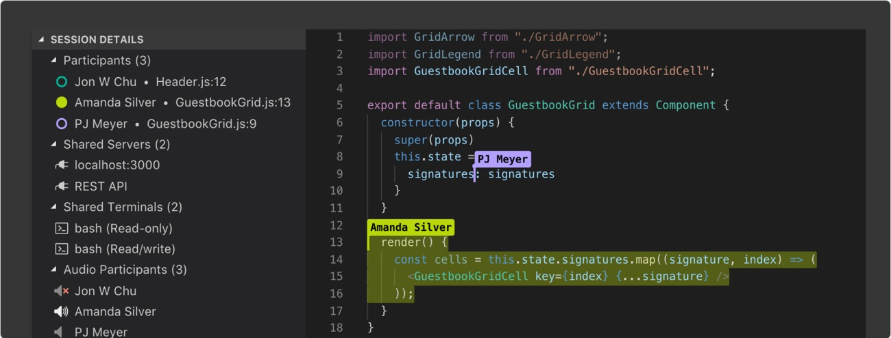
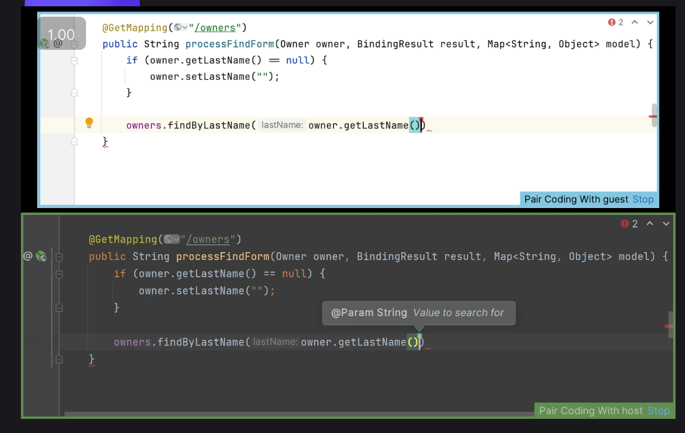
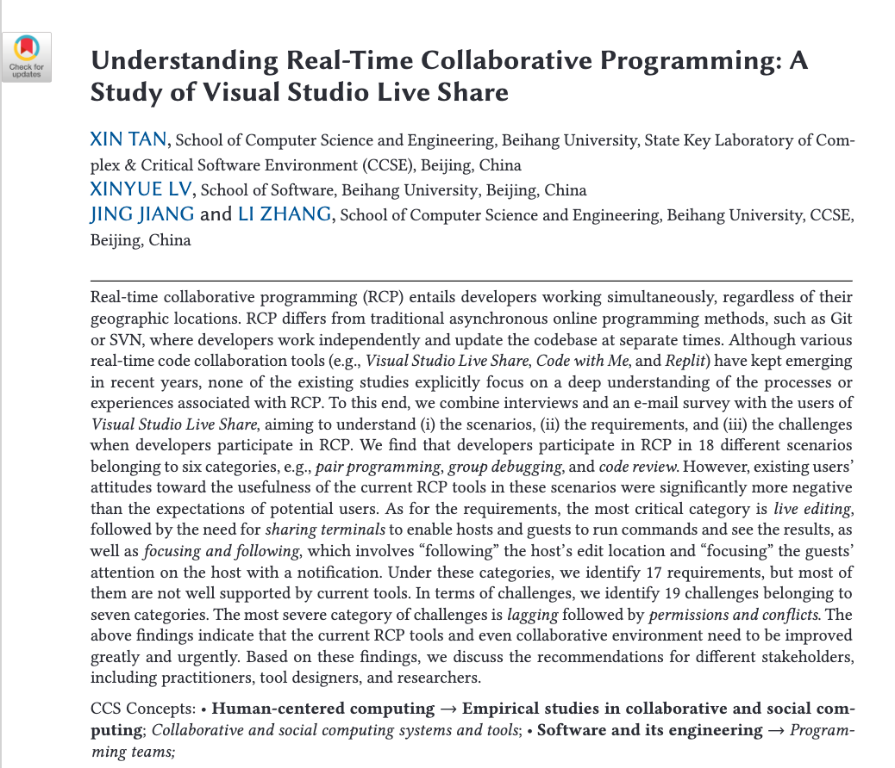
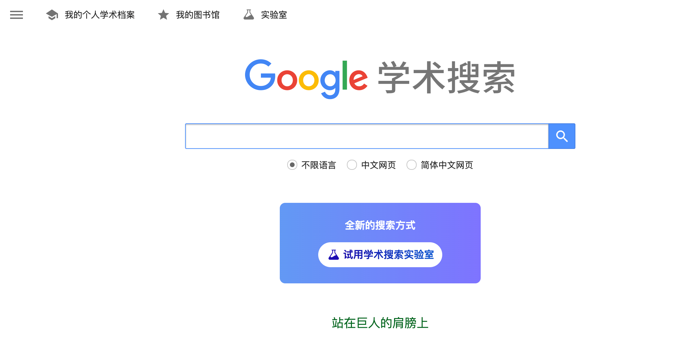

# 什么是实时协同编程？

实时协同编程（Real-Time Collaborative Programming, RCP）是一种允许多个用户像共同编辑在线文档一样，在各自的电脑上实时、同步地编辑同一份代码的编程范式。

它和我们熟悉的在线文档（如腾讯文档、Google Docs）是同一类交互：多个人同时修改同一份内容，每个人的改动会立即出现在其他人的界面上。区别在于，RCP 操作的对象是结构化和逻辑性都更强的代码，因此在一致性、冲突处理上的技术要求更高。

可以参考 [VS Code Live Share 的官方演示](https://visualstudio.microsoft.com/zh-hans/services/live-share/)，直观感受一下它的使用方式。

（个人觉得 JetBrains 的 Code With Me 做得更好。）

## 为什么它重要

实时协同编程在多个场景下都有实用价值：

- **结对编程 (Pair Programming)**：两名开发者共享同一个开发环境，一人编码、一人审查，可以实时交流。
- **远程协作 (Remote Work)**：团队成员可以在不同地点共同排查 Bug 或开发新功能，不必都到同一间办公室。
- **教学与辅导 (Mentoring)**：老师或资深工程师可以直接进入学生的编辑器，边讲边改。
- **在线面试 (Online Interview)**：面试官可以在共享环境中观察候选人的编码过程。

## 核心特征

- **实时性 (Real-Time)**：任何一位用户的增删改都能在毫秒级同步到其他人屏幕上。
- **并发性 (Concurrency)**：支持多个用户同时在不同位置、甚至同一位置编辑，不会因为锁定机制导致“一人编辑，他人等待”。
- **冲突解决 (Conflict Resolution)**：这是 RCP 的技术核心。当多人同时修改同一行代码时，系统需要自动合并这些修改，保证最终一致性。这通常依赖 **OT (Operational Transformation)** 或 **CRDT (Conflict-free Replicated Data Type)** 等算法，后续章节会展开。

## 主要挑战

- **技术挑战**：降低延迟、设计高效的冲突解决算法、保证传输安全、管理复杂的状态同步。
- **协同挑战**：让协作者感知到他人的光标位置和意图、避免相互干扰、在高强度协作中保持顺畅沟通。

## 常见的实时协同编程工具

市面上已有不少工具支持实时协同编程，基础功能一般免费：

| 工具 | 开发者/平台 | 简介 |
| :--- | :--- | :--- |
| **[Live Share](https://visualstudio.microsoft.com/zh-hans/services/live-share/)** | Microsoft | VS Code 和 Visual Studio 的插件，功能成熟。 |
| **[Code With Me](https://www.jetbrains.com/code-with-me/)** | JetBrains | 面向 JetBrains 系列 IDE 的协同开发服务。 |
| **[Zed](https://zed.dev/)** | Zed Industries | 主打高性能、内置协同功能的代码编辑器。 |
| **[Replit](https://replit.com/)** | Replit | 浏览器端的 Cloud IDE，天然支持多人协作。 |
| **[CodeSandbox](https://codesandbox.io/)** | CodeSandbox | Cloud IDE，在 Web 开发领域协同功能用得较多。 |

Live Share 可以直接在 VS Code 中使用，Code With Me 可以直接在 JetBrains 系列 IDE 中使用（没有订阅的话，可以通过[申请学生权益包](https://www.jetbrains.com/zh-cn/academy/student-pack/)获取）。Replit 可以直接在浏览器里使用。

## 文献综述

如果你希望从学术角度深入理解 RCP，可以读这篇论文：

> **[Understanding Real-Time Collaborative Programming: A Study of Visual Studio Live Share](https://dl.acm.org/doi/full/10.1145/3643672)**

它通过采访 Live Share 的真实用户，总结了 RCP 的特点、用户需求和核心挑战。仓库的 `./assets/Understanding Real-Time Collaborative Programming.pdf` 也附上了原文。

如果未来打算做研究，建议学会使用 [Google Scholar](https://scholar.google.com/) 检索文献。网络访问有困难时，可以请同学或学长帮忙，本文不展开。

## 总结

实时协同编程允许多个用户在同一份代码上实时协作，具备实时性、并发性和冲突解决三个核心特征，同时也面临技术和协同两方面的挑战。
