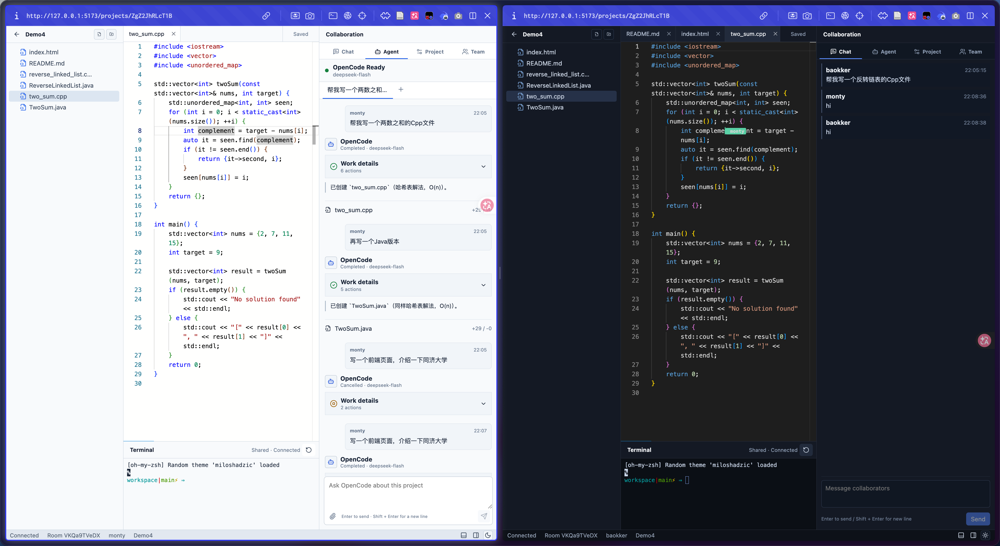

# SimpleRCPv2 项目概览

SimpleRCPv2 是一个在浏览器里使用的实时协同编程系统。几个人打开同一个项目，就能一起看文件、改代码、聊天、用同一个终端，也可以把任务交给内置的 Agent 去做。代码只在服务端保存一份，人和 Agent 改的是同一份。

读完这篇，你应该知道它能做什么、为什么要在 Collaboration Tools 之外再做一个，以及两者差在哪里。怎么跑起来见 [启动与运行](/simplercp_v2/getting_started.md)，代码结构见 [架构与二次开发](/simplercp_v2/architecture_and_secondary_dev.md)。

源代码仓库：[github.com/Baokker/SimpleRCPv2](https://github.com/Baokker/SimpleRCPv2)

> **版本说明**：本组文档按 `feature/foundation-identity-isolation` 分支编写。轻量成员身份（`members.json`、`auth/` 目录）、工作区与元数据分开存放、终端和 Agent 的环境变量过滤，这几项目前只在该分支上，合入 `main` 之前，`main` 上的代码与文档描述会有出入。

## 适合谁读

- 想体验一次实时协同编程、又不想装编辑器插件的同学。
- 读过 [Collaboration Tools 项目概览](/collaboration_tools/project_overview.md)，想知道新方案差在哪里的人。
- 准备在 SimpleRCPv2 上加功能的人。

## 它长什么样

进入项目后是一个浏览器工作区。左侧是文件树，中间是 Monaco 编辑器，右侧是协作和 Agent 面板，底部是共享终端和状态栏。多人编辑时能看到彼此的光标和选区，Agent 改了哪些文件、输出了什么、trace 是什么，也都显示在这个页面里。

> 截图来自项目 README 中的工作区示例。

## 为什么要再做一个

Collaboration Tools 走的是 VS Code 插件加 Host/Guest 的路线，带审批和完整的认证。能力比较全，但要看到效果，得把 server、Host、Guest 三端都拉起来，链路长，新人理解起来也费劲。

我们在做人和 Agent 一起写代码的实验时，需求其实更直接：

- 打开就能用，不用为一次协作装插件、开好几个窗口。
- 人和 Agent 在同一个地方改代码，彼此看得到。
- 代码只有一份，人和 Agent 不用各自维护副本再合并。

所以 SimpleRCPv2 做了三个取舍：客户端用浏览器，服务端的项目目录是唯一的代码来源，Agent 内置在系统里。其余功能尽量少做，方便快速改和二次开发。

## 能做什么

| 功能 | 说明 |
| --- | --- |
| 项目管理 | 在首页创建空白项目、导入服务端已有目录或 ZIP、打开和删除项目。首次启动会自动准备一个 Demo 项目 |
| 协同编辑 | Monaco 加 Yjs，同步多人的文本、光标和选区；文件树支持新建、重命名、删除 |
| 外部改动同步 | 终端命令或 Agent 直接改了磁盘上的文件，文件树和已打开的编辑器会自动更新 |
| 成员与聊天 | 填显示名（Role 可选）即可加入；成员列表、聊天和 Activity 会保存到磁盘，重启后还在 |
| 共享终端 | 每个项目一个 shell，所有成员看到同一个终端，终端输入会记在输入者名下 |
| Agent | 内置 OpenCode，默认接 DeepSeek。每个成员有自己的 session，可以创建、继续、取消任务，查看排队位置和 trace |
| 断线恢复 | 协作连接和终端连接会自动重连，也可以手动重试 |

## 刻意没做的

下面这些是有意不做的，不是遗漏。用之前心里要有数：

- **不做鉴权。** 成员身份只用来记录谁做了什么。知道别人的 `memberId` 就能以他的身份操作，所以只能在可信的内部环境里用，不要部署到公网。
- **没有命令和文件隔离。** 终端和 Agent 能访问服务端用户能读到的所有文件。系统只做了环境变量过滤，并把项目元数据放在工作区之外。
- **不处理冲突合并。** 人和 Agent 同时改同一个文件时，系统只会提示有并发修改，不会自动合并。
- **同一项目的 Agent 任务排队执行。** 不同项目之间可以同时执行。

## 与 Collaboration Tools 的对比

| 维度 | Collaboration Tools | SimpleRCPv2 |
| --- | --- | --- |
| 客户端 | 以 VS Code 插件为主（Extension Development Host），另有 Monaco 等模块 | 浏览器（React + Monaco + xterm.js） |
| 启动方式 | 构建 server，再用 F5 或脚本启动 Host、Guest 两个 VS Code | `pnpm install` 后 `pnpm dev`，打开 `http://127.0.0.1:5173` |
| 代码在哪 | Host 本地工作区，Guest 通过远程文件系统代理访问 | 服务端 `.simplercp-data/workspaces/<id>/`，浏览器、终端、Agent 共用 |
| 加入方式 | 邀请码，Host 点 Allow 后进入 | 打开项目，填显示名和可选的 Role |
| 身份 | JWT、简易登录、OAuth、Keycloak | 服务端分配的 `memberId`，不做鉴权 |
| 共享终端 | 没有 | 有，多人共用一个 shell |
| Agent | 没有内置，靠使用者自己的工具 | 内置 OpenCode + DeepSeek，带任务、session、trace |
| 部署形态 | server 加分发的 VS Code 扩展 | 一个服务进程（HTTP + WebSocket） |

简单说，Collaboration Tools 是让 VS Code 能多人协作的通用方案，SimpleRCPv2 是给人和 Agent 一起写代码用的轻量工作台。

## 延伸阅读

- [SimpleRCPv2 启动与运行](/simplercp_v2/getting_started.md)
- [SimpleRCPv2 架构与二次开发](/simplercp_v2/architecture_and_secondary_dev.md)，含代码入口
- [Collaboration Tools 项目概览](/collaboration_tools/project_overview.md)
